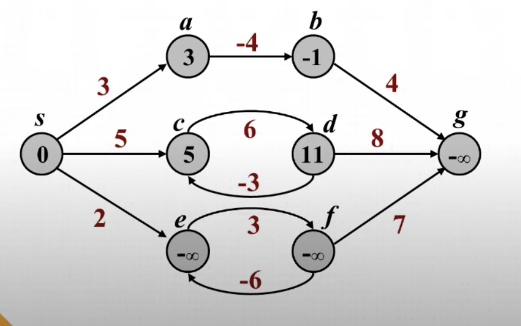
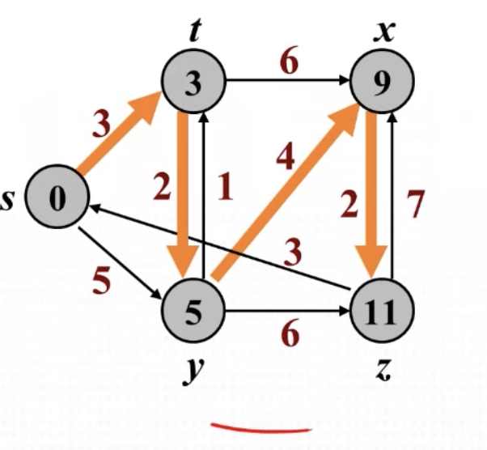

- [벨만-포드 알고리즘](#벨만-포드-알고리즘)
  - [벨만-포드 알고리즘이란?](#벨만-포드-알고리즘이란)
  - [벨만-포드 알고리즘 특징](#벨만-포드-알고리즘-특징)
    - [음의 사이클](#음의-사이클)
    - [Relaxation](#Relaxation)
  - [시간복잡도](#시간복잡도)
  - [알고리즘 구현 순서](#알고리즘-구현-순서)
  - [예시 문제](#예시-문제)
  - [Summary](#Summary)
  - [참고자료](참고자료)

# 벨만-포드 알고리즘

## 벨만-포드 알고리즘이란?

다익스트라 알고리즘과 동일하게 그래프에서 시작 정점으로부터 다른 모든 정점까지의 최단 경로를 찾는 알고리즘 → 최단 경로(Shortest Path) 탐색 알고리즘

> 알고리즘을 개발한 두 학자의 성을 따서 붙인 이름이라고 한다.

벨만-포드 알고리즘은 다익스트라 알고리즘과 다르게 아래의 2가지 큰 특징을 가지고 있다.

1.  **간선의 값이 음수**일 때도 사용 가능한 알고리즘
    - 음의 간선이 존재하는 경우 다익스트라 알고리즘은 음의 간선을 피해 최단 경로를 제대로 구하지 못한다.
2. **한 정점(시작점)에서 한 정점(도착점)으로** 가는 최단경로 문제를 해결하는 알고리즘


## 벨만-포드 알고리즘 특징

벨만-포드 알고리즘에는 크게 **음의 사이클**과 **Relaxation**이라는 특징이 존재한다


### 음의 사이클

위에서 언급한 벨만-포드 알고리즘의 주요한 특징 중 하나는 바로 간선의 값이 음수여도 사용 가능한 알고리즘이라는 것이다.

다만 음의 수가 양의 수보다 더 커서 한 정점에서 한 정점까지 지속적인 음수로 인한 사이클이 반복되면 무한의 수로 가게 되어 문제가 생긴다.



위의 그림을 보게 되면 시작점인 **s** 에서 도착점인 **g** 까지 가는 방법은 크게 3가지의 경우가 있다.

1. s -> a -> b -> g
2. s -> c -> d -> g
3. s -> e -> f -> g

1번의 경우 순환이 일방향으로 모든 간선이 이루어져 있기 때문에 순환이 될 수 없는 일반적인 구조이다.

반면 2,3번의 경우 간선이 여러개 있기 때문에 순환이 가능한 구조가 된다.

2번의 경우 c -> d -> c ... 로 c 와 d 에서 순환이 발생할 수 있지만 아무리 순환을 해도 +6+(-3) = 3으로 순환을 할 때마다 3이 추가된다

우리는 최단 경로를 구해야 하는데 순환할수록 길어지기 때문에 순환을 하지 않고 바로 g로 가게 되고 이는 문제를 발생시키지 않는다

3번의 경우 2번 처럼 e -> f -> e ... 로 e 와 f 에서 순환이 발생할 수 있고 순환을 할 때마다 +3+(-6) = -3으로 3이 감소된다

최단 경로를 구하는 입장에서 감소하는 것은 좋은 현상이기 때문에 계속 순환을 하게 되고 결국에는 **무한대**로 가게 되어 문제를 발생시킨다.

결국 최단 경로는 **음의 값을 가지는 순환이 없어야** 가능하다고 볼 수 있다.

**=> 순환을 피하기 위해서는 순환을 하지 않도록 노드의 갯수(V) - 1로 값을 갱신하게 되면 순환을 하지 못하고 한번에 끝낼 수 있다 (V - 1)**
    EX) 3개의 노드가 있는 경우 최대 2번만 갱신하는 과정을 제한하면 순환을 못하게 된다


### Relaxation



벨만-포드 알고리즘의 주요한 2번째 특징은 바로 **Relaxation** 이다.

위의 그림을 보면 s에서 x,z 로 가는 방법은 여러가지가 존재하는데 신기하게도 어떠한 방법으로 가던 최단 경로는 동일하게 된다

이러한 여러가지 방법이 존재할 때 어떤 경로를 택해야 될지 고민하는 부분이 Relaxation 이다.

여러 경로에 대한 부분을 해결하기 위해서 벨만-포드는 모든 싸이클을 다 돌게 된다.

**=> 모든 경로를 다 찾아보면서 현재 경로의 값보다 더 적은 경로의 값이 나오게 되면 값을 변경시켜주는 형태가 Relaxation이다.**\


## 시간복잡도
-> 벨만-포드의 시간복잡도는 V-1번 동안 모든 간선들을 검사하는 과정을 거치기 때문에 **O(VE)**가 된다.

결론적으로 **O(ElogV)**를 가지는 다익스트라 알고리즘보다 복잡도는 높지만 음수 간선이 존재할 때 사용할 수 있고 음의 사이클 여부를 판별할 수 있는 장점이 있다. 


## 알고리즘 구현 순서

1. 시작 정점이 있는 경우 시작 정점을 0 으로 픽스
2. 모든 거리 값을 무한대로 초기화
3. 첫 번째 정점부터 인접 정점들을 탐색하며 거리를 갱신
4. 3번의 과정을 반복
6. 모두 마친 후에 한번 더 앞선 과정을 반복하면서 이때 값이 갱신되면(업데이트되면) 음의 사이클이 있다는 것을 확인


## 예시 문제

> 예시 문제는 BOJ 11657 타임머신 문제

아주 전형적이고 간단한 벨만-포드 알고리즘 해결 문제

```cpp
#include <iostream>
#include <vector>

using namespace std;

#define INF 987654321

long long dist[502];
vector<pair<long long,long long>> v[502];

int main(){
    ios_base :: sync_with_stdio(false);
    cin.tie(NULL);
    cout.tie(NULL);

    int N,M;
    cin >> N >> M;

    bool cycle = false;

    for(int i = 0; i < M; i++) { //vector에 넣기
        int n1, n2;
        long long w;
        cin >> n1 >> n2 >> w;
        v[n1].push_back(make_pair(n2,w));
    }
    
    for(int i = 1; i <= N; i++) { //무한대로 초기화
        dist[i] = INF;
    }

    dist[1] = 0;
    for(int i = 1; i <= N; i++) { // N-1까지이고 N이 되면 음수 사이클이라는 소리
        for(int j = 1; j <= N; j++) {
            for(auto &n : v[j]) {
                if(dist[j] != INF && dist[n.first] > n.second + dist[j]) {
                    dist[n.first] = n.second + dist[j];
                    if(i == N)
                        cycle = true;
                }
            }
        }
    }
    if(cycle)
        cout << "-1\n";
    else {
        for(int i = 2; i <= N; i++) {
            if(dist[i] == INF)
                cout << "-1\n";
            else
                cout << dist[i] << "\n";
        }
    }
    return 0;
}
```


## Summary

1. 벨만-포드 알고리즘은 음의 간선을 포함할 수 있는 알고리즘, 음의 사이클이 없어야 함
2. 한 정점에서 다른 한 정점의 최단 거리를 구하는 그래프 알고리즘
3. 음의 사이클을 제외하기 위해 간선 검색 횟수를 최대 V-1로 설정
4. 모두 다 체크하는 방식으로 다익스트라 알고리즘보다 비효율적


## 참고자료

[컴퓨터 알고리즘 기초 17강 벨만-포드 알고리즘 | T아카데미](https://youtu.be/PIT-aYPPPIQ)

[벨만-포드 알고리즘](https://ratsgo.github.io/data%20structure&algorithm/2017/11/27/bellmanford/)